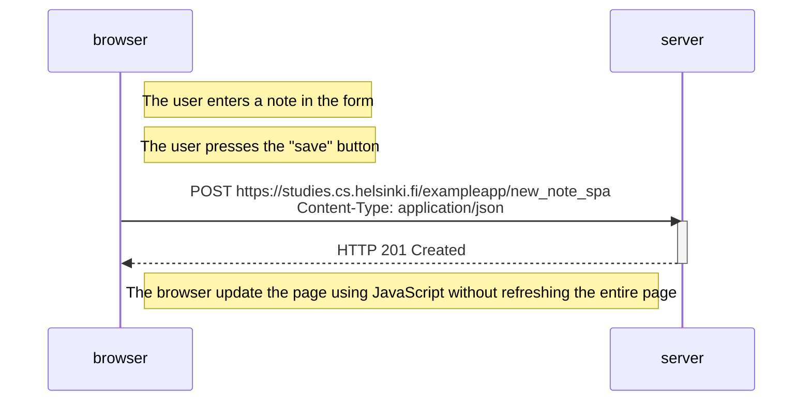

```mermaid
sequenceDiagram
    participant browser
    participant server
 Note right of browser: The user enters a note in the form
 Note right of browser: The user presses the "save" button

    browser->>server: POST https://studies.cs.helsinki.fi/exampleapp/new_note_spa<br>Content-Type: application/json
    activate server
    server-->>browser: HTTP 201 Created
    deactivate server
    Note right of browser: The browser update the page using JavaScript without refreshing the entire page
```
